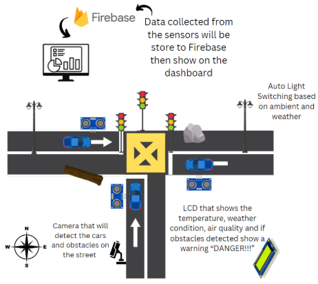
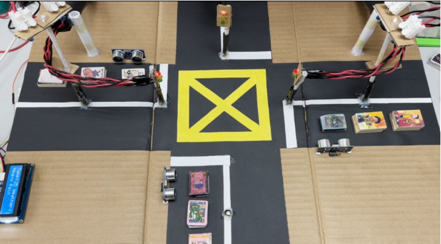
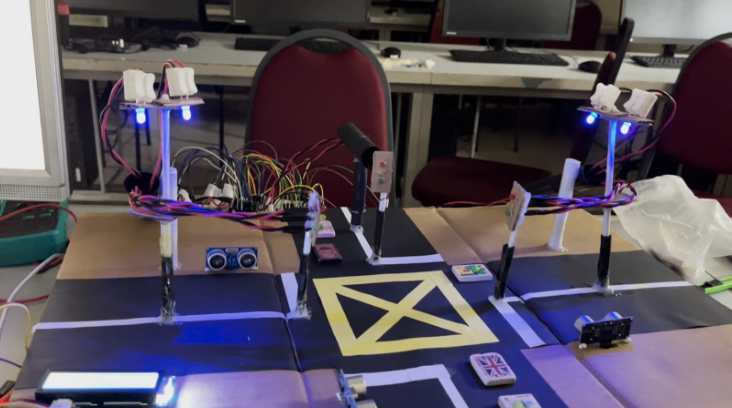
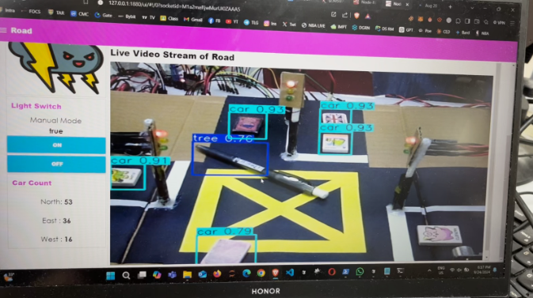
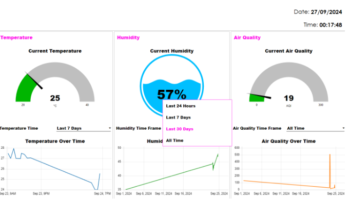

# Smart Street: IoT-Based Urban Traffic Management System
Smart Street is an IoT-powered urban traffic management system designed to optimize traffic flow, enhance road safety, and improve energy efficiency. 
By integrating smart street lighting, real-time traffic monitoring, AI-driven obstacle detection, and environmental data analysis, this system aims to create a more sustainable, efficient, and intelligent city infrastructure.

### Design of the system

### Key features
🚥 Intelligent Traffic Management: Uses ultrasonic sensors to dynamically adjust traffic light durations, reducing congestion.  
🔦 Smart Street Lighting: Controls LED lights based on ambient light, weather conditions, and traffic presence to reduce energy consumption. 
🚗 AI-Based Object Detection: Utilizes YOLOv8 to detect vehicles and road obstacles, enhancing safety. 
📊 Smart Dashboard: Provides real-time traffic analytics, environmental data visualization, and manual control options via Node-RED. 
☁️ Cloud Integration: Stores data in Firebase for remote monitoring and future analysis.

### Technology Stack
Hardware: ESP32, Raspberry Pi, Ultrasonic Sensors, Light Sensors, Cameras, LCD Screens 
Software: Node-RED, Firebase (NoSQL Database), YOLOv8 (AI for Object Detection), Python 
Connectivity: Wi-Fi, Cloud-based data processing

### Sample Screenshot
> Overall Prototype Design of Smart Street System
  
> Street Light on Night Time/Low Light Intensity
  
> Video Streaming with Object Detection in Node-Red Dashboard
  
> Environmental Page for Node-Red Dashboard

### Demo Video
[Watch the demo video](https://drive.google.com/file/d/1QjCv0xTVX308dj7dMI8DCwrBN8dt_dIn/view?usp=sharing)

